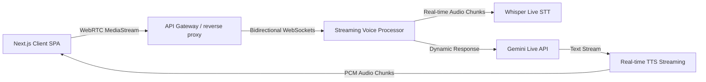
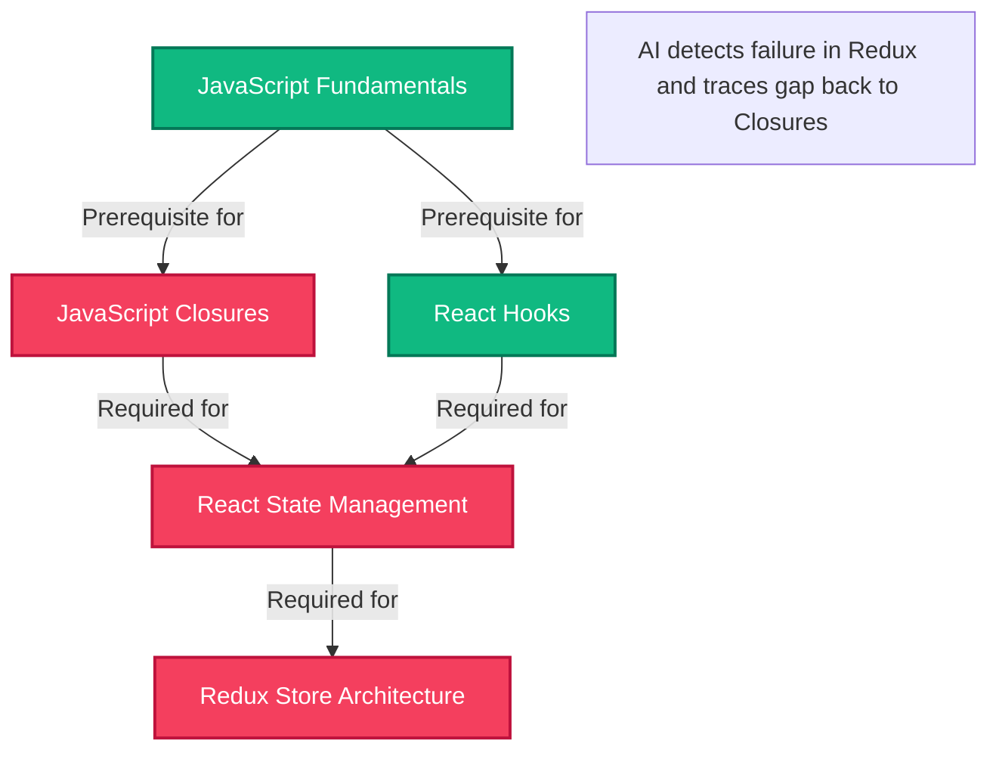

# HireReady: Strategic Future Enhancements Blueprint
## Academic & Enterprise Product Roadmap Proposal

This blueprint outlines a series of advanced, high-impact future enhancements for the **HireReady — AI Interview Coach** platform. Structured to align with rigorous academic standards (e.g., University of Mumbai MCA project guidelines) and modern software industry expectations, these recommendations elevate the platform from a full-stack tool to an enterprise-ready, multi-tenant career ecosystem.

---

## 1. Multi-Modal & Affective AI Analytics (Behavioral & Visual AI)
Currently, HireReady performs speech-to-text (STT) parsing, technical scoring via LLMs, and verbal pacing analysis. Transitioning to a **multi-modal** evaluation system will capture the crucial 55% of communication that is non-verbal.

### 1.1 Computer Vision & Emotion Recognition Engine
* **Technology Stack:** OpenCV, Google MediaPipe, TensorFlow Lite
* **Implementation Plan:**
  * **Gaze & Eye-Tracking Analysis:** Process WebRTC webcam frames in real-time or asynchronously to measure eye-contact consistency. A high frequency of downward or sideways gaze shifts can dynamically flag hesitation or anxiety.
  * **Micro-Expression & Facial Emotion Profiling:** Track facial landmark coordinates using MediaPipe. Calculate emotional states (e.g., confidence, stress, focus, confusion) by feedforwarding key face mesh distances to a light-weight Convolutional Neural Network (CNN).
  * **Posture & Body Language Audits:** Leverage MediaPipe Pose to analyze shoulder alignment, slouching, hand gestures, and overall physical composure, providing candidates with specific postural corrections.

### 1.2 Fine-Grained Audio & Acoustic Diagnostics
* **Technology Stack:** `librosa` (Python package), Praat (via Parselmouth)
* **Implementation Plan:**
  * **Acoustic Feature Extraction:** Extract vocal features such as pitch variability (F0 frequency distribution), intensity variance, vocal jitter (pitch instability), and shimmer (amplitude instability).
  * **Stress & Confidence Indexing:** High jitter/shimmer and monotonic pitch distributions correlate with performance anxiety. Synthesize these acoustic parameters into an objective **Confidence Index Score** displayed on the candidate's radar chart.
  * **Pause & Hesitation Segmentation:** Calculate silence duration ratios vs. active speaking time. Detect abnormal pauses (e.g., $>3.0$ seconds within a single sentence) and correlate them with the technical difficulty of the question to evaluate conceptual comfort.

---

## 2. Real-Time Streaming & High-Performance Architecture
To support scale and reduce latencies for voice interaction below the cognitive response threshold ($<400\text{ ms}$), the architectural boundaries can be shifted from batch HTTP APIs to persistent streams.

### 2.1 WebSockets & WebRTC Bidirectional Streaming
* **Technology Stack:** FastAPI WebSockets, WebRTC (via aiortc), OpenAI Whisper Streaming
* **Implementation Plan:**
  * Replace the current `MediaRecorder` batch upload pipeline (which uploads a full `.webm` audio chunk at the end of the response) with a active **WebRTC MediaStream**.
  * Stream raw PCM audio chunks continuously to a persistent WebSocket on the FastAPI backend.
  * Run a background thread using a streaming ASR (Speech-to-Text) pipeline to display words in near real-time, eliminating the "wait and process" delays.

### 2.2 Microservices Decoupling & Distributed Task Queues
* **Technology Stack:** Docker, gRPC, Celery, Redis, PostgreSQL
* **Implementation Plan:**
  * Decouple the monolithic FastAPI backend into independent, highly optimized microservices:
    1. **Authentication & User Profile Service** (FastAPI, OAuth2)
    2. **Interview Management Service** (FastAPI, session flow control)
    3. **Cognitive Analytics Service** (Python ML wrapper for Gemini & NLP fallback)
    4. **Report & Document Generator** (ReportLab PDF service)
  * Introduce **Celery** with **Redis** as a broker. Move heavy, non-blocking tasks—such as compiled PDF report generation, audio feature extraction, and historical analytics aggregation—to asynchronous worker queues to ensure the main API remains responsive.

---

## 3. Knowledge-Graph & Adaptive Learning System
To provide candidates with deep, structural career pathing, HireReady can evolve from rule-based skill mapping to a structural concept-dependency ontology.

### 3.1 Ontology-Driven Concept Graphs
* **Technology Stack:** Neo4j (Graph Database), Python Py2neo
* **Implementation Plan:**
  * Model all technical skills, job descriptions, and concepts as a directed graph.
  * Define relationships like `REQUIRES` or `DEPENDS_ON` (e.g., `Redux` $\xrightarrow{\text{DEPENDS\_ON}}$ `React State Management` $\xrightarrow{\text{DEPENDS\_ON}}$ `JavaScript Closures`).
  * If a candidate fails a question on Redux, the system does not just say "learn Redux". The AI traverses the graph backwards, dynamically tests the prerequisite nodes, identifies the root conceptual gap, and highlights the foundational concept in their study plan.

### 3.2 Automated Resource Curation & Learning Pathway
* **Technology Stack:** Vector Database (pgvector / Qdrant), LangChain
* **Implementation Plan:**
  * Index hundreds of open-source articles, documentation pages, tutorials, and YouTube educational videos into a vector database using semantic embeddings.
  * When a skill gap is verified (e.g., candidate struggles with *"Database Indexing in PostgreSQL"*), query the vector database for the most relevant, highly rated tutorials matching their exact level (Easy/Medium/Hard).
  * Synthesize these resources into a customized learning syllabus integrated directly into their dashboard.

---

## 4. Multi-Tenant Academic & Institutional Portal (TPO Dashboard)
To drive B2B2C adoption, HireReady can introduce dedicated portals for university administrations and college Training & Placement Officers (TPOs) to manage student groups.

### 4.1 Training & Placement Officer (TPO) Dashboard
* **Target Audience:** College Placements Team, Department Heads (such as at Bharati Vidyapeeth's IMIT)
* **Key Features:**
  * **Batch Performance Analytics:** Review aggregate metrics for an entire graduating class (e.g., MCA Batch 2025-2027) with high-level distributions of technical scores, communication gaps, and role alignments.
  * **Placement Readiness Index (PRI):** A composite score measuring a student's readiness across resume strength, technical competency, and verbal communication. Helps TPOs identify students who need additional coaching before actual corporate placement drives.
  * **Automated Batch Reports:** Export comprehensive Excel/PDF reports on class performance to present to college directors or academic accreditation committees.

### 4.2 Corporate Recruiter Portal (Asynchronous Screening)
* **Key Features:**
  * **Custom Interview Blueprints:** Recruiters can set up an assessment campaign (e.g., *"Junior Backend Developer Screen"*), specifying target skills, number of questions, and difficulty limits.
  * **Candidate Invitation & Screening Pipeline:** Candidates receive a secure link to complete their interview on HireReady.
  * **AI Shortlist Scorecard:** The platform automatically ranks applicants based on factual correctness, resume-role alignment, and communications metrics, providing recruiters with structured summaries and links to play back audio responses.

---

## 5. Gamification, Engagement, & Retention Mechanics
SaaS platforms thrive on consistent user interaction. Adding behavioral hooks will turn interview preparation into a daily learning habit.

### 5.1 Gamified Progression System
* **Mechanics:**
  * **XP (Experience Points) & Leveling Up:** Award XP for completing mock interviews, maintaining daily practice habits, or successfully resolving a follow-up question.
  * **Skill Badges:** Unlock achievements for specific achievements, such as:
    * `"Clean Speaker"` (zero filler words in a session)
    * `"System Design Guru"` (scoring $>8.5$ on a System Design interview)
    * `"SQL Warrior"` (correctly using complex SQL joins in an oral answer)
  * **Interactive Leaderboards:** Setup anonymous college-wide or global leaderboards to foster friendly peer competition.

### 5.2 Retrieval-Augmented Generation (RAG) for Company-Specific Tracks
* **Technology Stack:** pgvector, LangChain RAG pipeline
* **Implementation Plan:**
  * Scraping public, crowdsourced interview experiences (e.g., Glassdoor, LeetCode discussion forums, GeeksforGeeks archives) for key hiring partners (Google, Microsoft, TCS, Infosys, Accenture).
  * Embed and store these reports in a vector database.
  * Implement a **"Company Target Mode"** where the question generator adapts specifically to the question style, difficulty profile, and core values of the selected target company.

---

## Summary of Enhancement Impact & Priority Matrix

| Enhancement Area | Target User | Complexity | Core Benefit | Academic/Recruiter Value |
| :--- | :--- | :--- | :--- | :--- |
| **Multi-Modal Analytics** | Candidates | High | Evaluates eye-contact, posture, and vocal stress | Premium academic novelty; showcases cutting-edge AI skills. |
| **Streaming Voice Gateway** | Candidates | High | Achieves natural, sub-second latency voice flow | Demonstrates production-grade low-latency web engineering. |
| **Ontological Concept Graph** | Candidates | Medium | Pinpoints root conceptual gaps, not just keywords | Groundbreaking academic dissertation material. |
| **TPO Placement Portal** | Colleges | Medium | Allows central management of student cohorts | Highly marketable B2B feature; directly solves college placement tracking problems. |
| **Corporate Recruiter Portal**| Recruiters | Medium | Automates early-stage candidate screening | High commercialization potential for SaaS monetization. |
| **Gamification & RAG Tracks**| Candidates | Low | Boosts user retention with specific company targets | Maximizes student engagement and customer satisfaction. |
