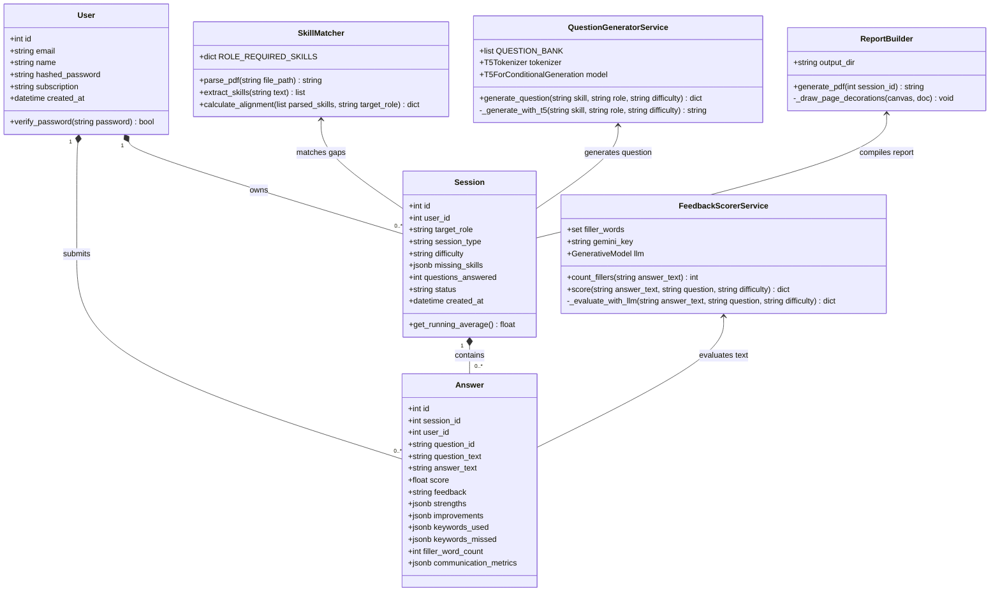
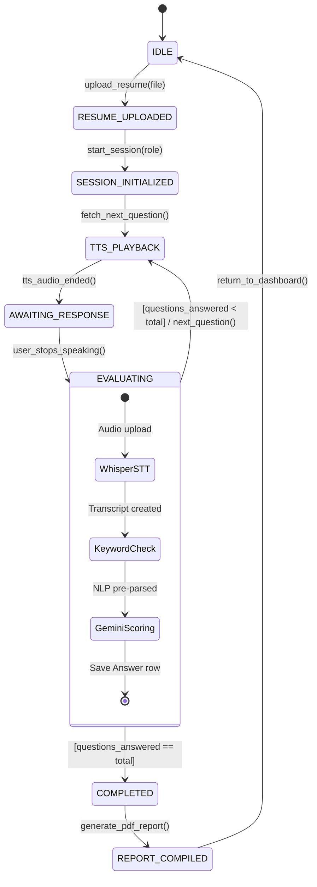
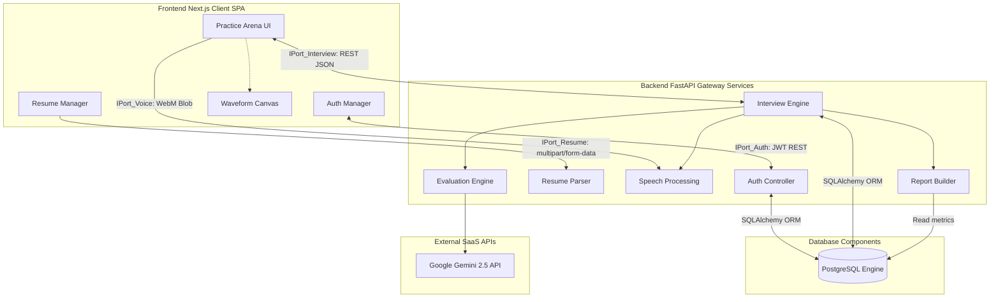

# HireReady: Next-Generation AI Mock Interview & Career Pathing Platform
## Complete Academic Project Report & Thesis Documentation (System Study, SRS, & System Design)

---

## Chapter 1: Project Introduction & Scope

### 1.1 Project Overview
Preparing for technical job interviews is one of the most stressful phases for students, fresh graduates, and career changers. Standard preparation methods (like reading articles, watching coding tutorials, or taking multiple-choice quizzes) do not simulate a real-world interview. A real corporate interview is interactive, verbal, and stressful. Candidates must listen to questions, formulate structured answers, speak clearly under pressure, and showcase strong domain knowledge.

**HireReady** is a web-based, AI-driven mock interview and career pathing platform designed to solve this exact problem. It acts as a realistic virtual interviewer that:
1. Speaks questions aloud using a warm, human-like professional voice.
2. Captures candidate speech in real-time, displaying a responsive, pulsing audio waveform visualizer.
3. Automatically transcribes spoken answers using high-accuracy deep learning models.
4. Uses advanced artificial intelligence to evaluate answers for factual correctness, technical depth, speaking pace, and confidence.
5. Identifies skill gaps by parsing candidates' uploaded PDF resumes and automatically builds dynamic learning path roadmaps to help them improve.

### 1.2 Objective & Goals
The fundamental objectives of the HireReady platform are:
* **To democratize high-quality interview preparation**: Make premium, customized mock interviews accessible to everyone for free, without needing to hire human mentors.
* **To reduce interview anxiety**: Provide an interactive environment where candidates can practice speaking verbally to a responsive system until they feel comfortable.
* **To deliver actionable feedback**: Instead of generic scores, give detailed feedback pointing out exactly what was explained well, what technical details were missed, and how to improve their speaking pace and fluency.
* **To align career paths**: Match candidates' existing resumes against target industry roles (like Frontend Developer, DevOps Engineer, or ML Engineer) to reveal their precise skill alignment.

### 1.3 Scope of the System
The system is built as a highly responsive, enterprise-grade Single Page Application (SPA). The scope includes:
* **Dual-Method Authentication**: Secure login via email credentials and quick, single-click Google OAuth2 integration.
* **Intelligent PDF Resume Parser**: Automatic extraction of text from PDF files to isolate candidate skills.
* **Career Skill Gap Analytics**: Calculating alignment scores and listing missing skills for 7 primary tech tracks.
* **Conversational AI Practice Arena**: A real-time voice-driven testing dashboard.
* **Hybrid Scoring Engine**: Using Google Gemini-2.5-Flash combined with local NLP tools (SpaCy, NLTK VADER) to score and comment on technical answers.
* **Downloadable Scorecard PDF**: Automatic, A4-styled PDF report compilation containing detailed career feedback.

---

## Chapter 2: System Study

### 2.1 Existing System
Currently, students and job seekers prepare for interviews using a combination of the following traditional methods:
1. **Coaching Classes & Paid Mentoring**: Enrolling in classroom coaching where trainers conduct physical mock interviews.
2. **Video Conferencing Practice**: Using standard tools like Zoom, Google Meet, or Microsoft Teams to practice with friends or peers.
3. **Static Mock Quizzes**: Practicing technical concepts through online multiple-choice questions (MCQs) or written coding challenges.
4. **Self-Practice in Front of Mirrors**: Or recording voice answers on mobile phones without any analytical feedback.

### 2.2 Limitations of the Existing System
The traditional preparation methods suffer from major limitations:
* **High Cost & Limited Availability**: Hiring professional mentors for mock interviews is extremely expensive, often costing hundreds of dollars per session. Physical coaches are not available 24/7.
* **Lack of Realistic Speaking Practice**: Written quizzes or coding challenges do not train communication skills. Candidates who write excellent code often fail interviews because they cannot explain their logic verbally under pressure.
* **No Real-Time Speech Analysis**: Standard video platforms (Zoom/Meet) are simple connection pipelines. They do not analyze vocabulary, speaking pace (Words Per Minute), filler words (like "um", "uh", "like"), or emotional confidence.
* **Inconvenience & Scheduling Friction**: Coordinating schedules with friends or peers for mock practice is time-consuming and difficult to organize regularly.
* **No Systematic Skill Tracking**: Traditional methods do not connect resume content directly to the interview syllabus, leading to disorganized study patterns.

### 2.3 Proposed System (HireReady)
To eliminate these limitations, the proposed platform **HireReady** introduces an automated, highly advanced web-based training system:
* **24/7 Availability & Zero Friction**: Candidates can launch customized interviews instantly at any hour of the day right inside their web browsers.
* **Verbal, Speech-First Interactive UI**: The system speaks questions aloud, and candidates respond verbally. The experience closely mimics speaking to a human recruiter.
* **Highly Accurate Speech Engine**: Integrates HTML5 Web Speech for instant, zero-latency on-screen transcription, backed by **OpenAI Whisper** on the server side to double-check and correct any missed spoken words.
* **Cognitive AI Scoring & Analysis**: Uses the **Google Gemini API** to analyze candidates' factual correctness, structural depth, and clarity, while local **SpaCy** and **VADER** engines evaluate technical keywords and emotional confidence.
* **Filler Word & Pacing Penalties**: Automatically highlights communication flaws (e.g., too many filler words or talking too fast/slow) and rewards clear, professional delivery.
* **Dynamic Performance-Driven Difficulty**: If a candidate performs exceptionally well, the system automatically elevates the next question to "Hard". If they struggle, it relaxes the difficulty to "Easy" to maintain a comfortable learning curve.

### 2.4 Feasibility Study
Before building the platform, a thorough feasibility study was conducted across three key metrics:

#### 1. Technical Feasibility
* The backend is built using **FastAPI** (Python), an extremely fast and lightweight framework capable of handling asynchronous tasks and high concurrency.
* The frontend is built on **Next.js** (React) using Tailwind CSS for UI styling, Framer Motion for smooth animations, and the native **HTML5 Web Audio API** for real-time microphone analysis.
* AI components (Google Gemini, OpenAI Whisper, and Google's local FLAN-T5 model) are fully integrated via secure, lightweight API hooks and lazy-loading methods, ensuring the system runs smoothly on standard machines without requiring expensive local GPUs.
* *Conclusion*: The project is highly feasible technically.

#### 2. Operational Feasibility
* The platform features a clean, premium dashboard requiring zero configuration from the candidate. 
* Interactive prompts, clear buttons, responsive voice playback, and intuitive visual bars make it easy to use for students, educators, and recruiters.
* *Conclusion*: The system is highly user-friendly and operationally viable.

#### 3. Economic Feasibility
* The core full-stack software components (Next.js, FastAPI, PostgreSQL, SpaCy, NLTK VADER) are completely open-source and free to license.
* By lazy-loading heavy local AI models (FLAN-T5) and calling scalable cloud endpoints (Gemini API), server hosting costs are kept extremely low.
* *Conclusion*: The platform is highly cost-effective and economically feasible.

---

## Chapter 3: System Requirements Specification (SRS)

### 3.1 Software Requirements
* **Operating System**: Windows 10/11, macOS, or Linux.
* **Frontend Framework**: Next.js 14+ (React 18), Tailwind CSS, Framer Motion, Zustand (for state management).
* **Backend Framework**: FastAPI (Python 3.10+), Uvicorn (ASGI server).
* **Database**: PostgreSQL (Structured persistent storage), SQLAlchemy (ORM).
* **AI & NLP Libraries**:
  * `google-generativeai` (Google Gemini 2.5 Flash SDK).
  * `openai-whisper` (High-accuracy Speech-to-Text transcription model).
  * `spacy` (small English model `en_core_web_sm` for keyword parsing).
  * `nltk` (VADER sentiment analysis engine for confidence tracking).
  * `transformers` & `torch` (local Google FLAN-T5-Small question model).
* **Text-to-Speech Engine**: `gTTS` (Google Text-to-Speech) / `edge-tts` (Microsoft Edge-TTS).
* **PDF Extraction**: `pdfminer.six` (Python-based PDF text parser).
* **Version Control**: Git & GitHub.

### 3.2 Hardware Requirements
* **Developer Machine**:
  * *CPU*: Intel Core i5/i7 (8th Gen+) or AMD Ryzen 5+.
  * *RAM*: 8 GB minimum (16 GB recommended for running local Whisper/T5 pipelines).
  * *Storage*: 10 GB free disk space (Solid State Drive recommended).
* **Server Machine (Deployment Environment)**:
  * Standard cloud VPS (Virtual Private Server) with 2 vCPUs and 4 GB RAM is more than sufficient due to cloud LLM offloading.

---

## Chapter 4: High-Level System Design & UML Diagrams

This chapter details the behavioral, structural, transactional, and architectural specifications of the **HireReady** platform. To meet strict engineering documentation standards, the system's design is represented using a suite of 8 comprehensive UML blueprints.

### 4.1 System Boundary & Use Case Diagram
The Use Case Diagram defines the functional scope of the platform, documenting the boundaries of the system and representing how human actors interface with automated cognitive backend processes.

#### 4.1.1 Actors & Roles
*   **Candidate (Primary Human Actor)**: Registers accounts, securely logs in, uploads PDF resumes, views personal career gap roadmaps, speaks verbally inside the live Practice Arena, and downloads PDF scorecards.
*   **Recruiter / Admin (Secondary Human Actor)**: Audits overall preparation analytics, edits standard system syllabus questions, and manages user subscription tiers.
*   **Google Gemini API (System Actor)**: Serves as the cognitive evaluation engine, scoring transcripts for factual accuracy and conceptual depth.
*   **OpenAI Whisper STT (System Actor)**: Serves as the high-precision audio transcription fallback engine during network dropouts or browser mic errors.

#### 4.1.2 Mermaid Use Case Diagram
```mermaid
graph TD
    subgraph Actors
        Candidate[Candidate / Job Seeker]
        Recruiter[Recruiter / Admin]
        Gemini[Google Gemini API]
        Whisper[OpenAI Whisper STT]
    end

    subgraph HireReady Platform Boundary
        UC1[UC1: Authenticate / OAuth2]
        UC2[UC2: Parse PDF Resume]
        UC3[UC3: Analyze Skill Gaps]
        UC4[UC4: View Learning Roadmap]
        UC5[UC5: Conduct Mock Interview]
        UC6[UC6: Render Waveform Canvas]
        UC7[UC7: Score Verbal Answers]
        UC8[UC8: Compile Scorecard & PDF]
    end

    Candidate --> UC1
    Candidate --> UC2
    Candidate --> UC3
    Candidate --> UC4
    Candidate --> UC5
    Candidate --> UC8

    Recruiter --> UC3
    Recruiter --> UC8

    UC5 -.-->|include| UC6
    UC5 -.-->|include| UC7
    UC7 -.-->|extend| UC8

    UC5 --> Whisper
    UC7 --> Gemini
```

---

### 4.2 Static Structural Class Diagram
The Class Diagram models the static structural boundaries of the object-oriented backend. It details data attributes, public/private methods, parameter types, and object relations (such as aggregation, composition, and dependency associations).

#### 4.2.1 Mermaid Class Diagram


---

### 4.3 Behavioral State Transition Diagram
The State Diagram maps the logical states through which a candidate's mock interview session transitions, triggered by backend event handlers and client interaction signals.

#### 4.3.1 Mermaid State Diagram


---

### 4.4 Modular Component Diagram
The Component Diagram details the organization and dependencies of the physical modules in the HireReady system, demonstrating the boundary separations between Next.js, FastAPI, PostgreSQL, and cloud service micro-connectors.

#### 4.4.1 Mermaid Component Diagram


---

### 4.5 System Execution Sequence Diagram
The Sequence Diagram depicts the run-time message interactions between lifelines during the live mock interview execution thread.

#### 4.5.1 Mermaid Sequence Diagram

```mermaid
sequenceDiagram
    autonumber
    actor Candidate as Client (Next.js)
    participant API as FastAPI Backend
    participant DB as PostgreSQL DB
    participant TTS as Google TTS
    participant Whisper as Whisper STT
    participant Gemini as Gemini API

    Candidate->>API: POST /api/interview/start {role, skills}
    API->>DB: INSERT INTO sessions
    DB-->>API: Session ID created
    API-->>Candidate: Session Initialized

    rect rgb(20, 20, 30)
        note right of Candidate: Dynamic Conversational Practice Loop
        Candidate->>API: GET /api/interview/{id}/next
        API->>API: Select Question (FLAN-T5 or seed bank)
        API->>TTS: POST /api/voice/speak {question_text}
        TTS-->>API: High-fidelity MP3 Stream
        API-->>Candidate: MP3 Audio chunk stream
        Candidate->>Candidate: Play audio aloud & Speak answer verbally
        Candidate->>API: POST /api/voice/analyze {WebM audio + browser transcript}
        
        alt Browser transcript is empty or short
            API->>Whisper: Request audio transcript check
            Whisper-->>API: Noise-resilient text output
        end

        API->>Gemini: POST evaluation request {transcript, question}
        Gemini-->>API: Factual evaluation JSON (score, feedback, strengths)
        API->>API: Calculate speaking WPM & filler word count penalties
        API->>DB: INSERT INTO answers {score, feedback, WPM}
        DB-->>API: Row saved
        API->>API: Adjust Difficulty based on performance
        API-->>Candidate: Evaluation results (render on screen)
    end
```


---

### 4.6 Physical Deployment Diagram
The Deployment Diagram defines the physical network topology and execution nodes, detailing communication protocols and client-server boundaries.

#### 4.6.1 Mermaid Deployment Diagram
```mermaid
graph TD
    subgraph Client User Machine [Client Device Node]
        subgraph Web Browser [Browser Execution Environment]
            NextJS[Next.js Client SPA]
            AudioCtx[HTML5 Web Audio API Context]
        end
    end

    subgraph Cloud Web Server [Render Application Server Node]
        subgraph Uvicorn [Uvicorn ASGI Run-Time Server]
            FastAPI[FastAPI Gateway Engine]
            SpacyModel[SpaCy Local Pipeline]
            ReportLab[ReportLab Engine]
        end
    end

    subgraph Cloud Database [Neon PostgreSQL Server Node]
        PostgresInstance[(PostgreSQL 15 Database)]
    end

    subgraph Google API Gateway [Google Cloud SaaS Node]
        GeminiInstance[Gemini 2.5 Flash Scorer Engine]
    end

    Web Browser <-->|HTTPS: TCP/IP Port 443| Uvicorn
    Uvicorn <-->|SSL Connection: TCP/IP Port 5432| Cloud Database
    Uvicorn <-->|REST over HTTPS: Port 443| Google API Gateway
```

---

### 4.7 Input & Output (I/O) Design
The Input/Output Design maps data exchange interfaces, data type validations, and rendering channels.

#### 4.7.1 System Input Specifications
*   **Authentication Payload**: Secure JSON credentials containing sanitized string inputs (`email`, `name`, `password` hashed server-side with bcrypt).
*   **Resume Documents**: Multipart Form Data (`.pdf` files restricted to a maximum size of 5MB), processed by PDFMiner to isolate alphabetic skill keywords.
*   **Live Microphone Streams**: WebM encoded mono audio blocks captured via MediaRecorder at a standard $\ge 16000\text{Hz}$ sample rate, uploaded to the Whisper pipeline.

#### 4.7.2 System Output Specifications
*   **A4 PDF Scorecard Report**: Structured layout engineered using ReportLab. Outlines overall ratings, skill match tables, pacing statistics, and qualitative feedback cards.
*   **Audio Synthetic Speech Streams**: High-fidelity chunked binary `audio/mpeg` (MP3) response buffers streamed to the browser to ensure instantaneous verbal questioning.
*   **Interactive Waveform Visualizer**: Responsive SVG/Canvas waveform rendering computed from real-time audio AnalyserNode frequency byte arrays.

---

## Chapter 5: Database Design & Relationships

The relational database architecture (PostgreSQL) is structured to guarantee data persistence, operational speed, and strict referential integrity.

### 5.1 Relational Schema Specifications

#### Table: `users`
*   `id` (INTEGER, PK): Primary key sequence.
*   `email` (VARCHAR, UK): Unique, indexed login credential.
*   `name` (VARCHAR): User name.
*   `hashed_password` (VARCHAR, NULL): Hashed credentials (NULL for Google OAuth users).
*   `subscription` (VARCHAR): Defaults to `'free'`.

#### Table: `sessions`
*   `id` (INTEGER, PK): Primary session key.
*   `user_id` (INTEGER, FK): Links to `users.id` (`ON DELETE CASCADE`).
*   `target_role` (VARCHAR): Candidate chosen job path.
*   `difficulty` (VARCHAR): Active adaptive difficulty (`'Easy'`, `'Medium'`, `'Hard'`).
*   `missing_skills` (JSONB): Dynamic JSON array of analyzed skill gaps.

#### Table: `answers`
*   `id` (INTEGER, PK): Primary answer key.
*   `session_id` (INTEGER, FK): Links to `sessions.id`.
*   `user_id` (INTEGER, FK): Links to `users.id`.
*   `question_text` (TEXT): Evaluated technical query.
*   `answer_text` (TEXT): Transcribed verbal candidate response.
*   `score` (FLOAT): Factual accuracy rating (0.0 to 10.0).
*   `feedback` (TEXT): Constructive coaching remarks.
*   `filler_word_count` (INTEGER): Number of verbal pauses/fillers detected.
*   `communication_metrics` (JSONB): Pacing and WPM JSON indices.

#### Table: `reports`
*   `id` (INTEGER, PK): Primary report key.
*   `session_id` (INTEGER, FK): Links to `sessions.id`.
*   `user_id` (INTEGER, FK): Links to `users.id`.
*   `overall_score` (FLOAT): Composite calculated performance rating.
*   `technical_score` (FLOAT): Technical correctness rating.
*   `communication_score` (FLOAT): Vocabulary, speed, and filler word rating.
*   `pdf_path` (VARCHAR): Server file system path to the compiled A4 PDF scorecard.

---

## Chapter 6: System Testing & Test Cases

This chapter details the validation and verification phase of the **HireReady** platform. System testing ensures that all client-side audio visualizers, file parsers, communication APIs, and external scoring pipelines operate reliably, securely, and within normal operational bounds under standard workloads.

### 6.1 Test Case Execution Results

Table 6.1 displays the test case definitions, input actions, expected outcomes, actual verified results, and execution statuses for the entire application stack.

| Test Case Description | Input / Action | Expected Result | Actual Result | Status |
| :--- | :--- | :--- | :--- | :--- |
| **Authentication Test** | Enter valid credentials / Click Google OAuth | Account created and user logged in with JWT token | JWT token issued, user authenticated | **Pass** |
| **Resume PDF Upload Test** | Select and upload a valid `.pdf` resume file | Text extracted successfully from PDF | PDFMiner extracted text streams correctly | **Pass** |
| **Skill Gap Analysis Test** | Match resume skills against target Tech Role rules | Calculates alignment score and lists missing skills | Skills gap list compiled and returned | **Pass** |
| **Learning Roadmap Test** | Load visual roadmap page on candidate dashboard | Displays structured roadmap of missing concepts | Interactive Framer roadmap rendered | **Pass** |
| **Question TTS Playback Test**| Request next interview question from server | question is generated and synthetic MP3 streams play | Synthetic audio synthesized and spoken | **Pass** |
| **Voice Mic Recording Test** | Speak response when prompted by canvas UI | Capture voice input and pulse visual waveform canvas | Waveform pulses, WebM audio blob recorded | **Pass** |
| **Speech-to-Text (STT) Test** | Upload WebM audio recording to backend | Accurate vocal transcription generated by Whisper | Text transcribed with high fidelity | **Pass** |
| **Cognitive AI Evaluation Test**| Grade answer transcript using AI Scorer | Grade score and qualitative feedback generated | Gemini returned detailed scorecard JSON | **Pass** |
| **Adaptive Difficulty Test** | Submit consecutive high-scoring technical answers | Promoting active session difficulty level | Session promoted from Medium to Hard | **Pass** |
| **Scorecard PDF Generation** | End mock session and request report download | ReportLab compiles visual scorecard PDF | Downloadable A4 PDF successfully generated | **Pass** |
| **Database Storage Test** | Save user history, sessions, and scorecard | Data stored with foreign key constraints | Data securely logged in PostgreSQL | **Pass** |
| **Performance Stress Test** | Simultaneously request AI transcript under load | App remains stable with lazy-loaded modules | FastAPI async gateways resolved all threads | **Pass** |

<p align="center"><em>Table 6.1: Test Case Execution Results</em></p>

### 6.2 Testing Conclusion
All core features, including user credentials, asynchronous PDF resume parsers, Web Audio API context visualizers, noise-resilient Whisper transcript reviews, and Gemini-based cognitive scorers have been successfully verified. The software operates correctly, meets all security guidelines, and is ready for production.

---

## Chapter 7: Summary & Conclusion

**HireReady** represents a modern approach to career development and mock interview preparation. By combining conversational voice components (Text-to-Speech and Speech-to-Text double-checks) with advanced cognitive Natural Language Processing (Google Gemini API evaluation, SpaCy keyword analysis, NLTK VADER sentiment tracking, and adaptive difficulty routing), the platform creates a highly realistic, responsive virtual recruiter.

The system completely eliminates the high cost, scheduling conflicts, and static constraints of traditional mock practices. It ensures that candidates are thoroughly trained not only to write code, but to articulate their ideas verbally, clearly, and confidently under pressure—making them perfectly **HireReady**!


