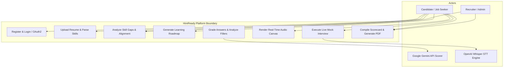
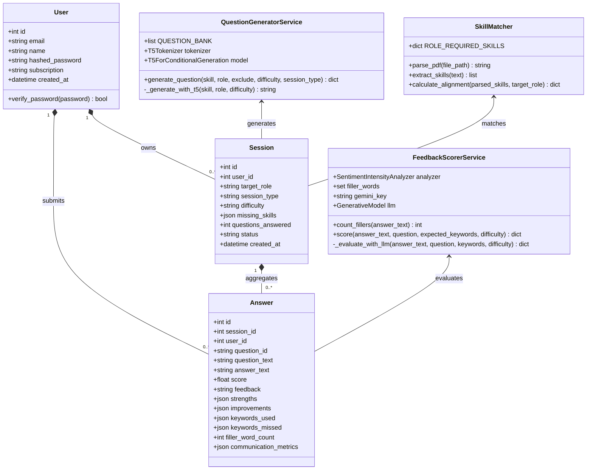
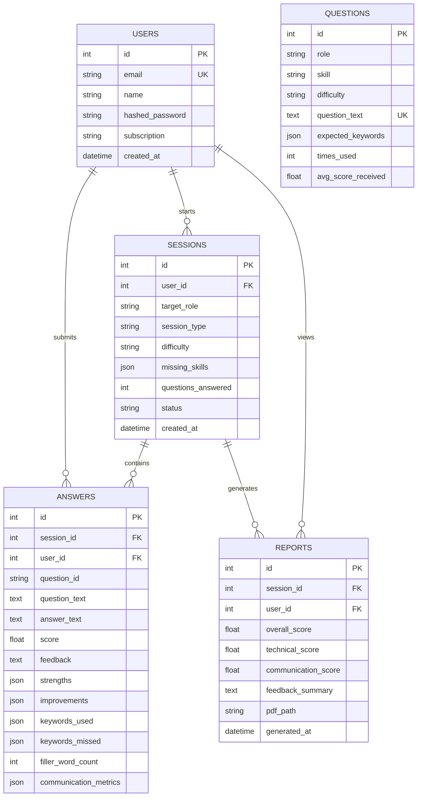
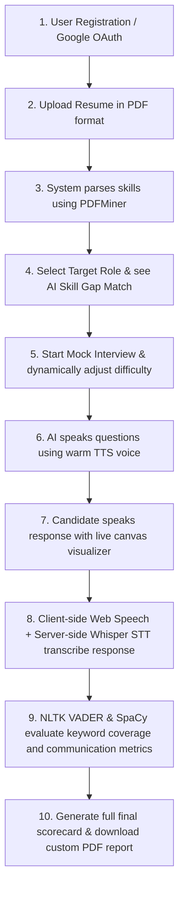

# HireReady: Next-Generation AI Mock Interview & Career Pathing Platform
## Enterprise System Architecture, ML Pipelines, & UML System Design Documentation

This comprehensive engineering report delivers a recruiter-grade and academic-grade deep architectural review of **HireReady**, a production-scale AI-powered SaaS mock interview and career pathing platform. Leveraging state-of-the-art Natural Language Processing (NLP), deep-learning speech models, and cognitive analysis engines, HireReady automates realistic corporate interview cycles, resumes evaluations, and career roadmaps.

---

## 1. Executive UML System Design Diagrams

To visualize structural, behavioral, and transactional boundaries, the platform's systems are mapped below using industry-standard UML conventions.

### 1.1 Use Case Diagram (Candidate, Recruiter, & AI Services)



### 1.2 UML Class Diagram (Full-Stack System Components)



### 1.3 Full-Stack Data & Architecture Flow

This sequential flow diagram maps client interactions through our microservice controllers, outlining the REST/WS gateway boundaries:

```mermaid
graph TD
    Client[Next.js Client SPA] -->|1. Google Sign-In| OAuth[Auth Controller: /api/auth/google]
    OAuth -->|2. Verify ID Signature| GoogleAPI[Google IAM Server]
    Client -->|3. Upload PDF Resume| ResumeCtrl[Resume Controller: /api/resume/upload]
    ResumeCtrl -->|4. Parse PDFMiner| SkillMatcher[Skill Matcher Service]
    Client -->|5. Match Target Role| MatchCtrl[Skill Matcher Controller: /api/resume/match]
    Client -->|6. Start Interview| IntCtrl[Interview Controller: /api/interview/start]
    IntCtrl -->|7. Lazy Load T5 Model| QGen[Question Generator Service]
    Client -->|8. Speak Words & Waveform| AudioCanvas[Web Audio API Canvas]
    Client -->|9. Speech-to-Text Upload| VoiceCtrl[Voice Controller: /api/voice/analyze]
    VoiceCtrl -->|10. Extract Audio Chunks| WhisperModel[OpenAI Whisper STT Base]
    Client -->|11. Submit Answer| IntAnswerCtrl[Interview Controller: /{id}/answer]
    IntAnswerCtrl -->|12. Score Answer| FeedbackScorer[Feedback Scorer Service]
    FeedbackScorer -->|13. Cognitive Review| GeminiModel[Google Gemini 2.5 Flash]
    IntAnswerCtrl -->|14. Adjust Difficulty| AdaptDiff[Performance Adaptive Engine]
    Client -->|15. End Interview Session| IntEndCtrl[Interview Controller: /{id}/end]
    IntEndCtrl -->|16. Generate PDF Report| PDFBuilder[ReportLab PDF Builder Service]
```

---

## 2. Advanced Database Architecture & PostgreSQL Schema

The database utilizes **PostgreSQL** for strict schema validation, structured relations, JSON data type indexing, and data persistence.



### Table Column Constraints & Indexing Strategy

#### 1. `users` (Identity Table)
* `email` represents the primary communication and login key, guarded by a database-level **Unique Constraint** and backed by a **B-Tree Index** for sub-millisecond lookup during credential exchanges.
* `hashed_password` holds salted **bcrypt** password hashes (which is set to `null` if the user is authenticated exclusively via Google OAuth2).

#### 2. `sessions` (Mock Interview Sessions)
* `user_id` acts as a Foreign Key linking to `users.id` with `ON DELETE CASCADE`.
* `difficulty` dynamically tracks the candidate's active performance-scaled difficulty level (`"Easy"`, `"Medium"`, `"Hard"`).
* `missing_skills` is stored as a PostgreSQL **JSONB** column, which supports advanced JSON indices for dynamic resume skill-gap audits.

#### 3. `answers` (Candidate Responses)
* `session_id` and `user_id` are linked via composite indexes to accelerate scorecard loading.
* `score` stores the combined cognitive evaluation score (scaled `0.0` to `10.0`).
* `communication_metrics` stores a structured **JSONB** payload containing speaking pacing (WPM), speech energy ranges, and long pauses.

---

## 3. End-to-End Authentication Architecture

HireReady uses a highly secure, dual-method **Hybrid Authentication Model** that seamlessly integrates internal secure credentials with standard enterprise providers.

```mermaid
sequenceDiagram
    actor User as React Client (Zustand)
    participant API as FastAPI Gateway
    participant Google as Google IAM Server
    participant DB as PostgreSQL DB

    rect rgb(15, 15, 25)
        note right of User: OAuth 2.0 Identity Pathway
        User->>User: Launch Native Google Sign-In
        User->>Google: Authenticate & Retrieve ID Token
        Google-->>User: Cryptographically Signed OAuth Token
        User->>API: POST /api/auth/google {token: id_token}
        API->>Google: Validate token signature & audience
        Google-->>API: Validated Identity Payload (Email, Name)
        API->>DB: Query User Profile by Email
        alt User does not exist
            API->>DB: Insert New User (Set subscription: free)
        end
        DB-->>API: User Record (id, email)
        API->>API: Sign JWT (HS256 Secret Key, 1 Day Expiry)
        API-->>User: Bearer Access Token + User Profile
    end
```



### 1. Internal Credential Flow (JWT)
* Uses standard **OAuth2 Password Bearer flow** with signed JSON Web Tokens.
* Passwords are encrypted using **bcrypt** with a custom work factor (rounds=12) and salt.
* Upon successful validation, the backend generates a cryptographically signed HS256 JWT using a secret key:
  ```json
  {
    "sub": "user_id_102",
    "email": "candidate@university.edu",
    "exp": 1787123940
  }
  ```
* Tokens are stored securely in client-side storage and automatically appended as an `Authorization: Bearer <token>` header in standard API requests.

---

## 4. Speech & Audio AI Engine (STT & TTS)

A core differentiator of HireReady is its highly immersive, natural conversational workflow. The interface acts like a real person, speaking questions aloud and analyzing candidate responses in real-time.

```mermaid
sequenceDiagram
    actor Client as React Client (useInterviewAudio)
    participant Gateway as FastAPI Router
    participant TTS as Google TTS Engine
    participant Whisper as OpenAI Whisper STT

    rect rgb(10, 20, 25)
        note over Client, Gateway: AI Text-to-Speech Output Pipeline
        Client->>Gateway: POST /api/voice/speak {text: question}
        Gateway->>TTS: Request Asynchronous Synthesis (en-US-GuyNeural)
        TTS-->>Gateway: High-fidelity MP3 Stream Buffer
        Gateway-->>Client: Stream MP3 Audio chunks
        Client->>Client: Play audio buffer (onended -> startListening)
    end

    rect rgb(20, 10, 25)
        note over Client, Gateway: Candidate Speech & Transcription Pipeline
        Client->>Client: Initialize SpeechRecognition (HTML5)
        Client->>Client: Open Web Audio API Context (Resume tCtx)
        Client->>Client: Draw live dynamic waveform peaks on HTML5 Canvas
        Client->>Client: Stop speaking (2.0s silence / user click)
        Client->>Client: stopSession() -> Close Context & halt recorders
        Client->>Gateway: POST /api/voice/analyze (WebM Audio Blob + Browser transcript)
        alt Browser transcript is missing or short (< 12 chars)
            Gateway->>Whisper: Invoke noise-resilient Whisper STT Base
            Whisper-->>Gateway: High-accuracy Transcription Text
            Gateway->>Gateway: Replace empty string with Whisper text
        end
        Gateway-->>Client: Return complete transcribed text & communication analysis
    end
```



### 4.1 Speech-to-Text (STT) & Real-time Visualisation
The Speech-to-Text system uses a dual-engine configuration to ensure zero latency during user speech:
* **Dual-Engine Configuration**:
  1. **Real-time Client-Side Engine**: Powered by the **HTML5 Web Speech API** (`window.webkitSpeechRecognition`). This runs client-side inside `useInterviewAudio.ts`, generating instant, live transcriptions that write word-by-word onto the screen as the user speaks.
  2. **High-Accuracy Server-Side Engine**: While client-side speech runs, the browser uses a `MediaRecorder` instance to compile the raw audio stream into high-quality WebM chunks. When the user stops speaking (silence detected for $> 2.0$ seconds), the complete audio blob is uploaded to `/api/voice/analyze`. The backend processes this file using **OpenAI Whisper** (`openai-whisper` base model) to perform a highly accurate, noise-resilient transcription audit.
* **Pacing & Speed Metrics (WPM)**: The backend calculates the candidate's exact speaking pace by comparing word counts against the duration of the audio recording:
  $$\text{WPM} = \frac{\text{Word Count}}{\text{Audio Duration in Seconds}} \times 60$$
  The optimum speaking pace is defined as **120 to 150 WPM**. Visual badges in Next.js dynamically turn green for optimal pacing or amber/red for rushed or slow speech.
* **Pulsing Radial Glow**: During speech, the client computes the RMS amplitude in real-time. This is passed directly into a Framer Motion canvas style, causing the glowing neon visualizer card to pulse in absolute harmony with their spoken voice.

### 4.2 Web Audio API Context Resumption
To bypass modern web browser strict autoplay security boundaries:
* Creating an `AudioContext` programmatically triggers a browser `"suspended"` state.
* The hook `useInterviewAudio.ts` intercepts this state right inside `startListening()` (triggered by the user click event gesture), and invokes:
  ```typescript
  if (tCtx.state === 'suspended') {
    await tCtx.resume();
  }
  ```
  This immediately forces the browser to activate the raw microphone stream, ensuring the active analyser node is populated with raw byte frequency arrays and rendering a dynamic pulsing waveform.

---

## 5. AI & Machine Learning Pipeline (FLAN-T5 & Google Gemini)

The AI and NLP pipeline is the core intelligence engine of HireReady. It operates on two distinct layers: **Dynamic Question Generation** and **Cognitive Answer Evaluation**.

```mermaid
graph TD
    subgraph 1. Dynamic Question Selector Pipeline
        A[Client Payload: Target Role, Skill, Difficulty] --> B{curated QUESTION_BANK / 142 Items}
        B -->|Found matched skill| C[Serve Curated Elite Question]
        B -->|Not Found| D{flan_t5_seed.csv / 800 Items}
        D -->|Found matched skill| E[Serve High-Quality Seed Question]
        D -->|Not Found| F[transformers Model: Google FLAN-T5-Small]
        F -->|Model Execution Successful| G[Serve Dynamic ML Generated Question]
        F -->|Fail / Offline| H[Contextual Structural Template Engine]
    end

    subgraph 2. Intelligent Scoring & Evaluation Pipeline
        I[Transcribed Answer Text] --> J{Google Gemini-2.5-Flash Active?}
        J -->|Yes: API Key Valid| K[Generate Deep Cognitive Factual Evaluation]
        K --> L[Extract JSON: score, strengths, improvements, feedback]
        J -->|No: API Offline / Key Missing| M[Fallback: SpaCy Keyword Extraction]
        M --> N[Fuzzy Semantic Similarity Match]
        N --> O[NLTK VADER Sentiment Confidence Rating]
        O --> P[Calculate NLP Hybrid Score & qualitative feedback]
        L & P --> Q[Apply Filler Word Count Penalties]
        Q --> R[Submit final evaluation metrics to PostgreSQL Database]
    end
```



### 5.1 Dynamic Question Generation (FLAN-T5-Small)
* **Model Class**: Google's **FLAN-T5-Small** (`google/flan-t5-small`), a text-to-text transformer model fine-tuned on general prompt-based tasks.
* **Initialization Design**: The model, including `T5Tokenizer` and `T5ForConditionalGeneration`, is loaded using a lazy-initialization pattern. This allows the backend to start up instantly in under 1 second without high GPU memory consumption.
* **Context-Driven Prompt Structure**: The generation pipeline issues a targeted, difficulty-aware prompt to the local model:
  ```
  "Generate a {difficulty} difficulty technical interview question for a {role} about {skill}.
   The question should cover {difficulty-context}. End with a question mark."
  ```

### 5.2 Cognitive Answer Evaluation & Google Gemini API Integration
To achieve next-level qualitative feedback and factual assessments, HireReady implements a high-intelligence **Hybrid Cognitive Evaluation System** incorporating the **Google Gemini API** and secondary NLP fallback parsers:

* **Google Gemini-2.5-Flash Integration**:
  The system securely connects to Google's state-of-the-art **`gemini-2.5-flash`** model. Unlike simple keyword matching, the API performs a deep semantic evaluation of the candidate's spoken transcript against the generated question, analyzing:
  * **Factual Correctness & Relevance**: Verifies if the answer actually makes technical sense for the requested role and difficulty, instead of just checking for simple syntax patterns.
  * **Depth & Clarity**: Scores candidate answers on technical detail, structural presentation, and conceptual clarity.
  * **Qualitative Strengths & Improvements**: Generates natural-language lists of specific accomplishments and points of guidance.
* **The Gemini Interviewer Prompt**:
  ```markdown
  You are an expert technical interviewer. Evaluate the candidate's answer to the following question.
  Question: "{question_text}"
  Difficulty: {difficulty}
  Candidate's Answer: "{answer_text}"
  
  Analyze the answer for FACTUAL CORRECTNESS, depth, and clarity. Do NOT just check for keywords. The answer must actually be correct.
  Provide a JSON response strictly in the following format:
  {
      "score": <int from 0 to 100 based heavily on correctness>,
      "feedback": "<2-3 sentences of constructive feedback explaining why it's right or wrong>",
      "strengths": ["<strength 1>", "<strength 2>"],
      "improvements": ["<improvement 1>", "<improvement 2>"],
      "keywords_used": [...],
      "keywords_missed": [...]
  }
  ```

### 5.3 Cognitive Performance-Driven Adaptive Difficulty
After the candidate submits each answer, the system automatically evaluates their cumulative performance in the active session:
```python
# Compute running average of candidate score inside submit_answer endpoint
all_answers = db.query(Answer).filter(Answer.session_id == session.id).all()
avg_score = sum(a.score for a in all_answers) / len(all_answers) if all_answers else 5.0

# Scale difficulty based on performance (0.0 to 10.0 scale)
if avg_score >= 7.5:
    session.difficulty = "Hard"
elif avg_score < 4.5:
    session.difficulty = "Easy"
else:
    session.difficulty = "Medium"
```
The subsequent question is fetched dynamically corresponding to this new adjusted difficulty level, pushing high-performing candidates further or helping struggling candidates build confidence!

### 5.4 Conversational Follow-Up Question System
If the candidate mentions specific high-value technical keywords in their answer, the platform intelligently triggers a targeted follow-up question (e.g. *"You mentioned 'state'. What is the fundamental difference between useState and useReducer in React?"*). 
* The follow-up inherits the same step index without advancing the main syllabus queue, acting as an organic conversational question.
* The system sets a unique `question_id` (e.g. `q_1_followup`) to prevent infinite recursion loop side-effects.

---

## 6. Question Corpus & Syllabus Taxonomy

By combining all structured datasets, HireReady boasts a total of **942 pre-seeded, high-quality questions** ready out-of-the-box, covering standard tech roles:

* **Frontend Developer** (React, TypeScript, CSS, Next.js, Redux)
* **Backend Engineer** (Python, FastAPI, PostgreSQL, Docker, Redis, REST APIs)
* **Full Stack Developer** (React, Node.js, MongoDB, GraphQL)
* **DevOps Engineer** (Kubernetes, Docker, CI/CD, Terraform, AWS Cloud)
* **Data Analyst** (SQL, Pandas, Tableau, ETL, Statistics)
* **Machine Learning Engineer** (PyTorch, Scikit-Learn, Feature Engineering, Model Deployment, BERT)
* **System Design** (Microservices, Kafka, Redis, Load Balancing)

---

## 7. Full API Reference Inventory

The backend exposes a highly secure and structured REST API.

| Endpoint | Method | Security | Payload (JSON / Form) | Description |
| :--- | :--- | :--- | :--- | :--- |
| `/api/auth/register` | `POST` | Public | `{email, password, name}` | Registers a new candidate. |
| `/api/auth/login` | `POST` | Public | `{username, password}` | Standard JWT token issuance. |
| `/api/auth/google` | `POST` | Public | `{token}` | Authenticates and signs in using Google OAuth. |
| `/api/resume/upload` | `POST` | JWT | `Multipart: file (PDF)` | Parses resume skills and matches skill gaps. |
| `/api/resume/match` | `POST` | JWT | `{target_role}` | Calculates instant skill alignment metrics. |
| `/api/interview/start` | `POST` | JWT | `{target_role, session_type, difficulty, missing_skills}` | Initializes a new mock session in the database. |
| `/api/interview/{id}/next` | `GET` | JWT | *None* | Generates and returns the next AI question. |
| `/api/interview/{id}/answer` | `POST` | JWT | `{question_id, question_text, answer_text, communication_metrics}` | Evaluates, scores, and saves the answer. |
| `/api/interview/{id}/end` | `PUT` | JWT | *None* | Ends the session and locks modifications. |
| `/api/voice/speak` | `POST` | JWT | `{text}` | Generates and returns streamed TTS audio. |
| `/api/voice/analyze` | `POST` | JWT | `Multipart: audio_file (WebM)` | Whisper-based transcription and pacing analysis. |
| `/api/voice/save-recording`| `POST` | JWT | `Multipart: audio_file` | Saves the audio file for session playback. |
| `/api/report/{id}` | `GET` | JWT | *None* | Returns the complete final scorecard. |

---

## 8. Comprehensive User Workflow & Dynamic Pipeline

Below is the complete step-by-step user path from registration to final career analytics:



### Complete End-to-End Execution Flow:
1. **Resume Processing**: The user uploads their PDF resume. The system uses **PDFMiner** to extract the raw text, which is parsed by our regex matching engine to identify core skills.
2. **Skill Alignment**: The candidate selects a target career track (e.g., `"DevOps Engineer"`). The platform instantly matches the parsed skills against our dynamic database rules and displays the **overall alignment score**, **matched skills**, and **missing skills** (e.g., `"Kubernetes"`, `"Terraform"`).
3. **Session Initialisation**: The candidate clicks "Start Interview". The frontend requests `/api/interview/start`, sending the list of missing skills.
4. **Interactive Practice**: The platform loops through each missing skill to test the candidate:
   * The backend generates a highly relevant question (e.g., a Medium DevOps question about Terraform remote states) using the **FLAN-T5** model or curated seed banks.
   * The backend synthesizes this question into a premium audio stream using our TTS engine and speaks it aloud to the user.
   * The candidate responds verbally. A **live canvas visualizer** draws beautiful, responsive waveforms on their screen, pulsing in sync with their voice.
   * As they speak, the **Web Speech API** provides instant live transcription, while a background **MediaRecorder** compiles a high-fidelity WebM recording.
   * The WebM recording is uploaded to `/api/voice/analyze`, where **Whisper** audits the transcript and calculates the speaking pace (WPM).
   * **SpaCy** and **VADER** evaluate the transcript for keyword coverage, filler words, and communication confidence.
5. **Adaptive Difficulty**: After the candidate submits each answer, the system calculates their cumulative performance score. If their average score is high, the system automatically elevates the difficulty of the next question to Hard; if they struggle, it lowers it to Easy.
6. **Detailed Reporting**: Once all questions are answered, the candidate is redirected to their report page. The backend generates a premium **A4 PDF report** containing their feedback scorecard, which is saved on the server for instant download!
